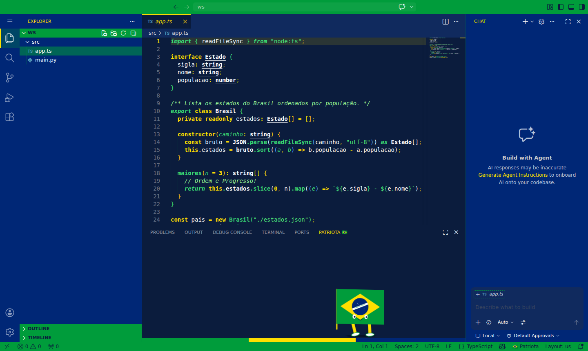
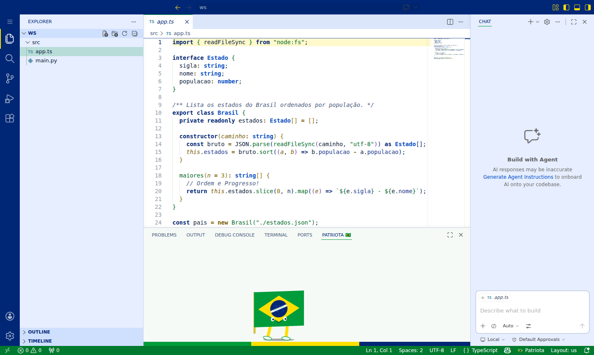

# 🇧🇷 Patriota — Tema VS Code



Tema escuro com as cores oficiais da bandeira do Brasil: **azul `#002776`**, **verde `#009c3b`**, **amarelo `#ffdf00`** e **branco**. Feito para devs brasileiros.

## 🎨 Duas variantes

| Patriota (escuro) | Patriota Claro |
|---|---|
|  |  |

Escolha com `Ctrl+K Ctrl+T` → **Patriota** ou **Patriota Claro**.

## ✨ Recursos

- **Tema completo**: editor, sidebar, abas, terminal, debug, testes, SCM graph e ícones de símbolos.
- **Chat / Copilot**: cores para Chat, Inline Chat e _ghost text_ (sugestões do Copilot).
- **Brackets coloridos**: 6 níveis (verde, amarelo, branco, azul...) com guias de pares.
- **Realce semântico** para classes, funções, métodos, namespaces e mais.
- **🇧🇷 Bandeirinha, o pet**: uma bandeira do Brasil com perninhas que anda pelo painel inferior.
  - Clique nela para comemorar (confete + pulo).
  - Comemora sozinha quando uma task termina com sucesso.
  - Comandos: `Patriota: Chamar o pet Bandeirinha` e `Patriota: Comemorar! 🎉`.
  - Configurações: `patriota.pet.size` (small/medium/large) e `patriota.pet.speed` (slow/normal/fast).

> **Sobre o pet do Copilot:** o GitHub Copilot não expõe API para trocar nenhum mascote/pet, e extensões não conseguem alterar outras extensões. Por isso o Patriota traz o seu próprio pet.

## 🛠️ Desenvolvimento

```bash
python3 scripts/validate_theme.py   # valida cores e contraste (todos os temas)
python3 scripts/build_light.py      # regenera o tema claro
npm run screenshots                 # prints num VS Code real (requer code-server)
python3 -m pytest tests             # testes
npx @vscode/vsce package            # gera o .vsix
```

Regras do projeto (veja `AGENTS.md`): máximo de 150 linhas por arquivo de código, validação e testes antes de commitar.

📦 Publicação: veja [PUBLISHING.md](PUBLISHING.md).
